Hello there! 👋🏻

I am a self-taught Fullstack Developer and Business & Design graduate.  
For frontend I prefer SvelteKit and Qwik, both with TypeScript, but I also worked with React and Vue.  
On the Backend I like to work with Go or TypeScript.
 
 
Among my own projects, my favorite one is the [Red Dead Online Discord Bot](https://github.com/YoRHa-A5/rdo-discord-bot) which I created from scratch and is running to this day on a private server.
 

#### Fun facts
- Golden Kiwis are my favorite fruits
- I am an oil painter
- I love helping others in Arc Raiders

 

### Contributions to projects

- [Qwik](https://github.com/QwikDev/qwik/pull/7211) – Frontend Framework
- [DiscordGo](https://github.com/bwmarrin/discordgo/pull/1262) – Discord API Go Library
- [Go-Chi](https://github.com/go-chi/docs/pull/5) – Go Router
- [Denon](https://github.com/denosaurs/denon/pull/96) – Nodemon equivalent for Deno
- [Recent Activity](https://github.com/Readme-Workflows/recent-activity/pull/272) – Profile readme activities

### Recent activity

<!--RECENT_ACTIVITY:start-->
- ⭐ Starred [google-research/timesfm](https://github.com/google-research/timesfm) 
- ↪ Opened PR [#2](undefined) in [YoRHa-A5/Doro](https://github.com/YoRHa-A5/Doro) 
- ↪ Opened PR [#1](undefined) in [YoRHa-A5/Doro](https://github.com/YoRHa-A5/Doro) 
- ⭐ Starred [ihor-sokoliuk/mcp-searxng](https://github.com/ihor-sokoliuk/mcp-searxng) 
- ⭐ Starred [jo-inc/camofox-browser](https://github.com/jo-inc/camofox-browser) 
<!--RECENT_ACTIVITY:end-->

<!--RECENT_ACTIVITY:last_update-->
Last Updated: Sunday, May 3rd, 2026, 3:40:21 AM
<!--RECENT_ACTIVITY:last_update_end-->